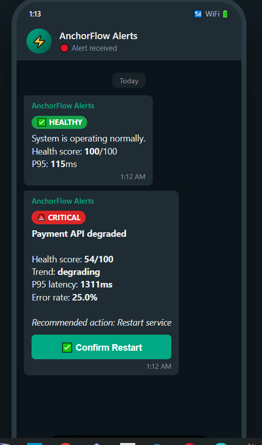
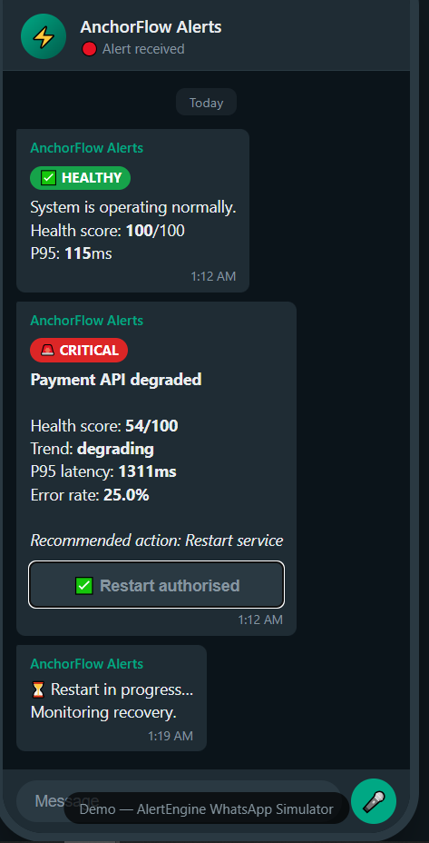

# ⚡ fastapi-alertengine

**Fix your API in production in under 30 seconds — from your phone.**

When a critical endpoint starts failing, dashboards don't help.  
You need to **know immediately — and act.**

---

🔥 259/259 tests passing  
🏦 Built from real financial infrastructure (AnchorFlow / Tofamba)  
🤖 AI-agent ready (Claude / Copilot / Cursor)  
⚡ Runs with or without Redis (memory mode)

---

## 📱 See It In Action

**Healthy → Failure → Alert on your phone → Tap → Recovered**




> Built on a live payment processing system. Alert fires within 60 seconds of degradation. Recovery is one tap.

---

## 🧠 Why This Exists

AlertEngine was built for systems under real pressure — not dashboards.

While building **AnchorFlow**, a payment orchestration platform on mobile money rails in Zimbabwe, I needed monitoring that:

- Never crashes the request path
- Doesn't depend on external SaaS
- Doesn't just report — but **guides recovery**

So instead of paying $400/month for slow tooling, I built an **embedded stability circuit**.

**Goal:** Reduce MTTR from minutes of panic → seconds of controlled action.

The system enters the **Central Bank of Zimbabwe regulatory sandbox in May 2026** — where zero-failure assumptions get tested against real conditions.

---

## 🚀 Quickstart (2 minutes)

```bash
pip install fastapi-alertengine
```

```python
from fastapi import FastAPI
from fastapi_alertengine import instrument

app = FastAPI()
engine = instrument(app)
```

Done. You now have a live observability + recovery pipeline.

---

## 🔌 What You Get (Instantly)

| Endpoint | Purpose |
|---|---|
| `GET /health/alerts` | P95 latency, error rate, health score |
| `GET /incidents/timeline` | Append-only incident log (Redis ZSET) |
| `GET /incidents/replay` | Full trace reconstruction |
| `GET /actions/suggest` | Recovery actions (JWT signed) |
| `GET /actions/audit` | Audit log of every action attempt |
| `GET /intelligence/health` | Health breakdown + trend direction |
| `GET /pipeline/status` | detect → evaluate → suggest → authorize → log |

---

## 🏦 The $0 SaaS Tax Strategy

| Feature | Datadog / Sentry | Prometheus / Grafana | ⚡ AlertEngine |
|---|---|---|---|
| Setup | ~30 mins + config | Days (infra + YAML) | < 2 mins (middleware) |
| Cost | $50–$500/month | Infra + maintenance | $0 (self-hosted) |
| Primary Output | Dashboards & alerts | Raw metrics & graphs | Actionable decisions |
| Architecture | External (SaaS) | Sidecar / distributed | Embedded (in-process) |
| Actionability | ❌ Observe only | ❌ Interpret yourself | ✅ Suggests next action |

---

## 📊 Example Output

```json
{
  "status": "critical",
  "health_score": {
    "score": 54.0,
    "trend": "degrading"
  },
  "metrics": {
    "overall_p95_ms": 1311.0,
    "error_rate": 0.25
  },
  "alerts": [
    {
      "type": "error_anomaly",
      "severity": "critical",
      "triggered_by": "absolute_threshold",
      "reason_for_trigger": "Error rate 25% exceeds threshold (5%) by 400%"
    }
  ]
}
```

✔ No optional fields. ✔ Stable schema. ✔ Safe for automation and AI agents.

---

## 🧩 Core Capabilities

### 1. Smart Detection
- Tracks P95 latency per route template (`/users/{id}` not `/users/123`)
- Learns baseline traffic automatically
- Detects rate-of-change spikes before absolute thresholds are crossed

### 2. Health Scoring
- Composite 0–100 score with weighted components
- Trend direction: `improving` / `stable` / `degrading`
- Rolling analysis via linear regression

### 3. Incident Intelligence
- Redis-backed append-only timeline (ZSET)
- Full incident replay via trace ID
- Baseline comparisons and deviation percentages in every alert

### 4. Recovery Suggestions
- Ranked by priority: CRITICAL / HIGH / MEDIUM
- JWT-signed tokens with optional IP binding
- Never auto-executes — human or agent must confirm

```json
{
  "action":         "restart",
  "priority":       "CRITICAL",
  "token":          "eyJ...",
  "auto_permitted": false,
  "triggered_by":   "health_score < 66"
}
```

---

## 🔐 Recovery Pipeline

```
detect → evaluate → suggest → authorize → log
```

- Tokens signed with `ACTION_SECRET_KEY` (HS256)
- Optional IP binding
- JTI replay protection via Redis
- Human or agent must explicitly authorize — nothing fires automatically

---

## ⚙️ Configuration

| Variable | Default | Description |
|---|---|---|
| `ALERTENGINE_REDIS_URL` | `redis://localhost:6379` | Redis connection string |
| `ALERTENGINE_P95_WARNING_MS` | `1000` | P95 warning threshold (ms) |
| `ALERTENGINE_P95_CRITICAL_MS` | `3000` | P95 critical threshold (ms) |
| `ALERTENGINE_BASELINE_LEARNING_MODE` | `false` | Enable adaptive threshold learning |
| `ALERTENGINE_HEALTH_CRITICAL_THRESHOLD` | `40` | Health score below which status = critical |
| `ACTION_SECRET_KEY` | *(unset)* | Required to enable action tokens |

---

## 🤖 AI-Agent Ready

Stable schema — no nulls, no variation. Directly consumable by agents.

```python
if health["health_score"]["score"] < 40:
    suggestions = await client.get(f"{base_url}/actions/suggest")
    for action in suggestions.json()["suggestions"]:
        if action["priority"] == "CRITICAL" and action["token"]:
            await client.get(
                f"{base_url}/action/restart",
                params={"token": action["token"]}
            )
```

| Field | Description |
|---|---|
| `health_score.score` | 0–100 composite score. Below 40 = critical. |
| `health_score.trend` | `"improving"` / `"stable"` / `"degrading"` |
| `alerts[].triggered_by` | `"absolute_threshold"` / `"adaptive_threshold"` / `"rate_of_change"` |
| `alerts[].reason_for_trigger` | Human-readable — safe to pass directly to an LLM |
| `suggestions[].token` | Signed JWT — pass directly to `/action/restart` |

Works with Claude Code, GitHub Copilot, and Cursor.

---

## 🧠 Philosophy

Most tools answer: **"What happened?"**

AlertEngine answers: **"What should I do right now?"**

---

## ✅ Reliability

- 259/259 tests passing (pytest + httpx + fakeredis — Python 3.10, 3.11, 3.12)
- Circuit breaker: CLOSED → OPEN → HALF_OPEN → CLOSED. Redis failures never affect the request path.
- Memory mode: runs without Redis — useful for local development and CI.
- Bounded fallback buffer: 500 events held in memory during outages, drained on recovery.
- JTI replay protection: No action token can fire twice.

---

## 🛡️ Stability Audits & Active Recovery

AlertEngine is the engine behind a production observability service for teams that cannot afford downtime but do not have a full SRE function.

| Tier | What You Get | Price |
|---|---|---|
| **24h Forensic Audit** | Full P95 & error analysis. Identifying revenue leaks your current monitoring misses. | `$1,500` |
| **Revenue Protection Engine** | Proprietary AlertEngine install. P95 monitoring on revenue-critical endpoints. | `$4,500` |
| **Active Recovery Shield** | AlertEngine + WhatsApp Command Center. CEO-level mobile control with 5-second authorized recovery. Your kill switch. | `$9,500` |

This is not a report. It is an operational control system.

→ **[View on Upwork](https://www.upwork.com/freelancers/~01f56dcb08577b4472?viewMode=1)**  
→ **[anchorflow@outlook.com](mailto:anchorflow@outlook.com)** for direct consulting

---

## 🗺️ Roadmap

| Feature | Status |
|---|---|
| WhatsApp incident alerts (Twilio) — detect → notify → confirm → restart | 🔄 In progress |
| Hosted alert engine (SaaS mode) | 📋 Planned |
| Multi-service correlation | 📋 Planned |
| Grafana dashboard JSON provisioning | 📋 Planned |

---

## 📬 Contact

**📧 [anchorflow@outlook.com](mailto:anchorflow@outlook.com)**  
**🐙 [github.com/Tandem-Media/fastapi-alertengine](https://github.com/Tandem-Media/fastapi-alertengine)**

---

## 📄 License

MIT — free to use, modify, and deploy. No strings attached.
